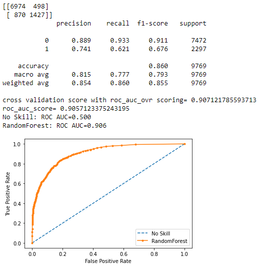
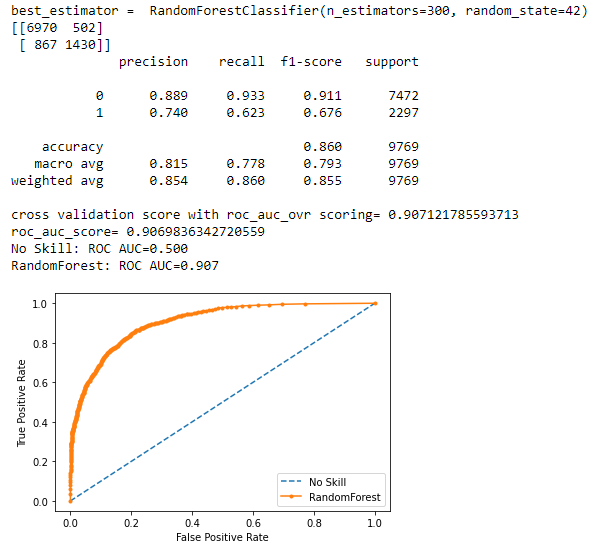
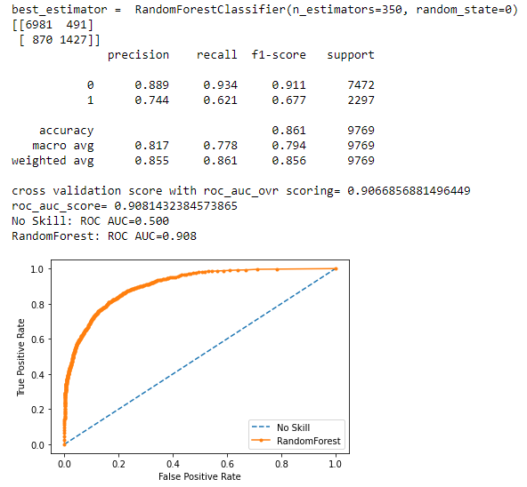
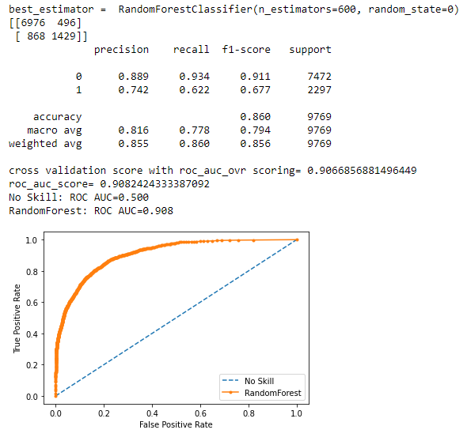

#  Model evaluation challenge - US Income

## Mission
One evening, while you were minding your own business watching the latest show on Netflix, you get an e-mail from a stock broker à la *Wolf of Wall Street*... the type of guy that only cares about sex, drugs and money.

He asks a favor from you.

At first, you are put off and stop reading. However, you remember that that guy has lots of money and likes to throw it around, so you read further.

He asks a simple question: *Are you able to predict the income of every US citizen?*

**How hard could that be ? Not that hard, no ?** True.

However, one has to be careful about how the data is processed to not give false results. That is why you are tasked, as a group, to discuss and implement various ways to get a correct prediction from a machine learning model.

## Mission objectives

- Be able to analyze a machine learning problem
- Be able to reason about possible causes of overfitting
- Be able to remedy the causes of overfitting
- Be able to tune parameters of a machine learning model
- Be able to write clean and documented code.

### Must-have features

- Baseline accuracy
- Multiple evaluation metrics
- Hyper parameter tuning
- Some type of validation strategy

##### Datasets: 
   - data_train.csv. Contains train data.
   - data_test.csv. Contains test data.

### Author:
* Hoang Minh (Minh6019)

### Step 1: Data preprocessing

 - The data is cleaned but "X_test" is too big. I reorganise to have "80/20" for "X_trai/Xtest".

#### RandomForestClassifier:
##### I begin with: n_estimators=100:
 + when "y=1" : the recall is not so high (0.593)
 

##### After I try with : GridSearchCV _ param_grid = {'n_estimators': [100, 200, 300], 'max_features': ['auto', 'sqrt', 'log2'}
 

##### After I try with : GridSearchCV _ param_grid = {'n_estimators': [350, 400, 450], 'max_features': ['auto', 'sqrt', 'log2'}
      

  
##### After I try with : GridSearchCV _ param_grid = {'n_estimators': [500, 550, 600], 'max_features': ['auto', 'sqrt', 'log2'}
      
 
    
### Conclusion 
  + when **'n_estimators'** goes up, the **'recal'** goes up too but it stabilise at 'n_estimators'=600.
  + **roc_auc_ovr** scoring stabilise at **Kfold =10**
 
# Timeline: 
13/08/2021 - 16/08/2021
